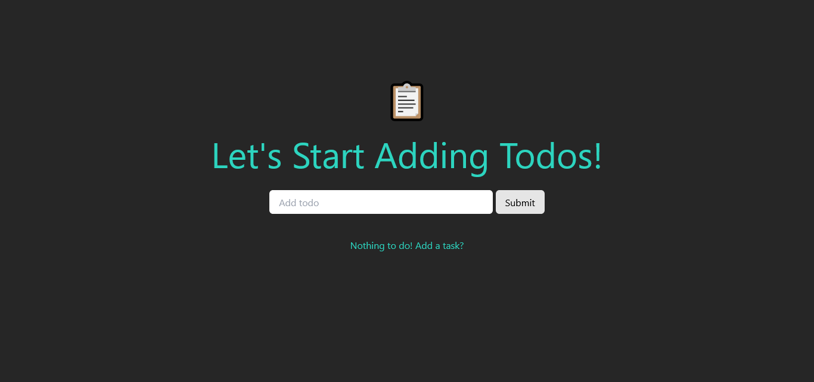

# 📋 TodoList - OOP, MVC JS Todo App.

This is an object-oriented javascript to-do list app using the MVC architecture. 

## Table of contents

- [Overview](#overview)
  - [Screenshot](#screenshot)
  - [Links](#links)
- [My process](#my-process)
  - [Built with](#built-with)
- [Author](#author)

## Overview

### Screenshot

### Links

- [TodoList](https://mvc-oop-todolist.netlify.app)

## My process

### Built with

- Webpack.
- Tailwind CSS.
- Vanilla JavaScript.

## Author

- Portfolio - [Shaher Ashraf](https://thegoat7.netlify.app/)
- Linked In - [Shaher Ashraf](https://www.linkedin.com/in/shaher88223/)
